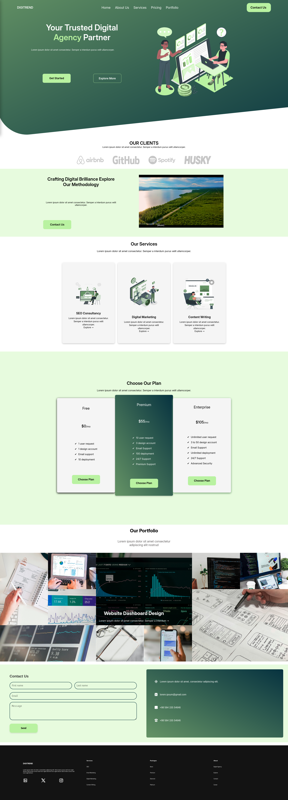
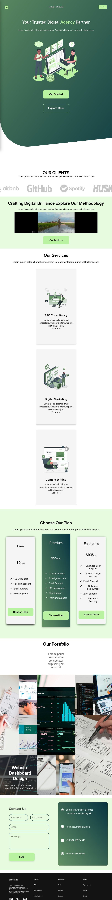
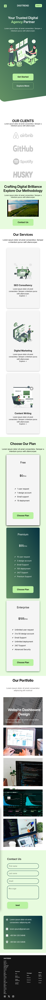

# D I G I T R E N D


Landing page da agência digital de marketing **Digitrend**.

## 📄 Sobre

Esta é a landing page da **Digitrend**, desenvolvida com foco na apresentação do modelo de negócio, serviços, portfólio e chamada para contato.

## 🚀 Tecnologias Utilizadas

- HTML5
- CSS3 
- JavaScript

## 📁 Estrutura do Projeto

```
├──src
    ├── assets
    │   ├── clients
    │   ├── contact
    │   ├── footer
    │   ├── hero
    │   ├── menu-line.svg
    │   ├── portfolio
    │   └── services
    ├── index.html
    ├── script.js
    └── styles
        ├── about.css
        ├── contact.css
        ├── footer.css
        ├── header.css
        ├── home.css
        ├── portfolio.css
        ├── pricing.css
        ├── services.css
        └── styles.css
```


## 🎯 Funcionalidades

- Menu de navegação com versão mobile responsiva  
- Sessão de apresentação da agência  
- Sessão de serviços  
- Sessão de preços  
- Sessão de portfólio com grid responsivo  
- Botões de CTA (Call to Action)  
- Seção de contato  

## 📌 Como Usar

1. Clone o repositório:
   ```bash
   git clone https://github.com/alexandrendev/digitrend-web
   ```

2. Abra o arquivo `src/index.html` em seu navegador. E pronto! Agora você pode visualizar a página em seu navegador!

## 🖼️ Pré-visualização

<h3 align="center">Preview - Desktop | Tablet | Mobile</h3>

<table align="center">
  <tr>
    <th>Desktop</th>
  </tr>
  <tr>
    <td></td>
  </tr>
</table>

<table align="center">
  <tr>
    <th>Tablet</th>
  </tr>
  <tr>
    <td></td>
  </tr>
</table>

<table align="center">
  <tr>
    <th>Mobile</th>
  </tr>
  <tr>
    <td></td>
  </tr>
</table>

